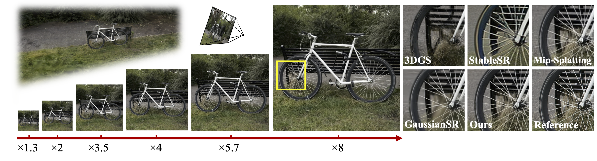

# Arbitrary-Scale 3D Gaussian Super-Resolution

<div align="center">

**AAAI 2026**

<a href="https://huimin-zeng.github.io/3DASR/assets/paper.pdf"></a> 
<a href="https://www.arxiv.org/abs/2508.16467"></a> 
<a href="https://huimin-zeng.github.io/3DASR/"></a>
<a href="https://github.com/huimin-zeng/Arbi-3DGSR/blob/main/LICENSE"></a>

[Huimin Zeng](https://huimin-zeng.github.io/), [Yue Bai](https://yueb17.github.io/), [Yun Fu](https://www1.ece.neu.edu/~yunfu/)

</div>


## Overview
Existing 3D Gaussian Splatting (3DGS) super-resolution methods typically perform high-resolution (HR) rendering of fixed scale factors, making them impractical for resource-limited scenarios. Directly rendering arbitrary-scale HR views with vanilla 3DGS introduces aliasing artifacts due to the lack of scale-aware rendering ability, while adding a post-processing upsampler for 3DGS complicates the framework and reduces rendering efficiency.

To tackle these issues, we build an integrated framework that incorporates **scale-aware rendering**, **generative prior-guided optimization**, and **progressive super-resolving** to enable 3D Gaussian super-resolution of arbitrary scale factors with a single 3D model. Notably, our approach supports both integer and non-integer scale rendering to provide more flexibility.

**Key Features:**
- ✅ Arbitrary-scale super-resolution (integer and non-integer scales)
- ✅ Single model for all scale factors
- ✅ Real-time rendering at high resolutions (85 FPS at 1080p)
- ✅ Significant quality improvement (6.59 dB PSNR gain over vanilla 3DGS)




## 🔥 News

- **2026/1/19**: We released [code](https://github.com/huimin-zeng/Arbi-3DGSR) and [checkpoints](https://drive.google.com/drive/folders/17VLVogpdliNVbPu5QOZaZsPDyqPlqsWD?usp=sharing) for this project.

- **2026/1/16**: We built a webpage for this project. Check out the [project page](https://huimin-zeng.github.io/3DASR/) for interactive comparisons!

- **2025/11/15**: Our Arbi-3DGSR was accepted to **AAAI 2026**.


## Preparation

### Requirements

- Python 3.10
- CUDA 12.1 or later
- PyTorch 2.1.2 (with CUDA 12.1 support)
- torchvision 0.16.2
- pytorch-lightning 1.4.2

#### Option 1: Docker (Recommended)

We provide a Docker image environment for easy setup:

```bash
sudo docker run --gpus all -it -v /mnt/nvme1/huimin:/mnt/nvme1/huimin -v /home/public/huimin:/home/public/huimin --shm-size 64g zeldam1/zhm_docker:zhm-py310-torch21 /bin/bash

cd Arbi-3DGSR

pip install pyiqa==0.1.10 pytorch-lightning==1.4.2 torchmetrics==0.6.0 taming-transformers-rom1504 scikit-learn kornia==0.6 open_clip_torch==2.0.2 transformers==4.38.2 clip accelerate==1.12.0 submodules/simple-knn submodules/diff-gaussian-rasterization
```

#### Option 2: Conda Environment

```bash
# Clone the repository
git clone git@github.com:huimin-zeng/Arbi-3DGSR.git
cd Arbi-3DGSR

# Create conda environment
conda create -y -n Arbi-3DGSR python=3.10
conda activate Arbi-3DGSR

# Install PyTorch with CUDA 12.1
pip install torch==2.1.2 torchvision==0.16.2 torchaudio==2.1.2 --index-url https://download.pytorch.org/whl/cu121

# Install torch-scatter
pip install torch-scatter==2.1.2+pt21cu121 -f https://data.pyg.org/whl/torch-2.1.0+cu121.html

# Install other dependencies
pip install pytorch-lightning==1.4.2 torchmetrics==0.6.0 open-clip-torch==2.0.2
pip install pyiqa==0.1.10 taming-transformers-rom1504 scikit-learn kornia==0.6 transformers==4.38.2 clip accelerate==1.12.0

# Install submodules
pip install submodules/diff-gaussian-rasterization
pip install submodules/simple-knn
```

### Dataset Preparation

Download datasets from [Gaussian Splatting](https://github.com/graphdeco-inria/gaussian-splatting) and prepare them with the following structure. Each scene should contain images at different resolutions for training and evaluation:

```
data/
├── db/
│   ├── drjohnson/
│   │   ├── images/          # Original resolution images
│   │   ├── images_x2/       # 2x downsampled images
│   │   ├── images_x4/       # 4x downsampled images
│   │   ├── images_x8/       # 8x downsampled images (training resolution)
│   │   ├── images_x8_3.5/   # Non-integer scale (8x -> 3.5x downsampled)
│   │   ├── images_x8_5.7/   # Non-integer scale (8x -> 5.7x downsampled)
│   │   └── sparse/          # COLMAP reconstruction
│   └── playroom/
│       └── ...              # Same structure as drjohnson
├── MipNeRF360/
│   ├── bicycle/
│   ├── flowers/
│   └── ...                  # Other scenes
├── synthetic_nerf_blender/
│   ├── chair/
│   ├── drums/
│   └── ...                  # Other scenes
└── tandt/
    ├── train/
    └── truck/
```

**Note:** 
- To create multi-resolution datasets, you can use image downsampling scripts to generate `images_x2`, `images_x4`, `images_x8`, etc., from the original `images/` folder.

- Non-integer scale folders (`images_x8_3.5/`, `images_x8_5.7/`) are optional but recommended for arbitrary-scale evaluation


## Quick Start

### Training

Train a model from scratch on the Deep Blending dataset:

```bash
# Train only
bash script/db.sh --train

# All-in-one: train, render, and evaluate
bash script/db.sh
```

Other datasets:
- **NeRF Synthetic**: `bash script/blender.sh --train`
- **MipNeRF-360**: `bash script/mipnerf360.sh --train`
- **Tanks & Temples**: `bash script/tandt.sh --train`

### Rendering

1. We provide pretrained checkpoints at [Google Drive](https://drive.google.com/drive/folders/17VLVogpdliNVbPu5QOZaZsPDyqPlqsWD?usp=sharing)

2. Extract and organize the checkpoints:
```
output/
├── db/
│   ├── drjohnson/
│   └── playroom/
├── synthetic_nerf_blender/
│   ├── chair/
│   ├── drums/
│   ├── ficus/
│   ├── hotdog/
│   ├── lego/
│   ├── materials/
│   ├── mic/
│   └── ship/
└── MipNeRF360/
    ├── bicycle/
    ├── flowers/
    └── ...
```

3. Render at different scales:
```bash
# Render only
bash script/db.sh --render

# Or render for other datasets
bash script/blender.sh --render
bash script/mipnerf360.sh --render
```

### Evaluation

Compute image quality metrics (PSNR, SSIM, LPIPS):

```bash
bash script/db.sh --eval
```


## Scripts Usage

All scripts support the following flags:

- `--train`: Run training only
- `--render`: Run rendering only  
- `--eval`: Run evaluation only
- No flags: Run all (train, render, eval)

**Examples:**
```bash
bash script/db.sh --train    # Training only
bash script/db.sh --render   # Rendering only
bash script/db.sh --eval     # Evaluation only
bash script/db.sh            # All steps
```


## Citation

If you find this work useful, please cite our paper:

```bibtex
@article{zeng2025arbitrary,
  title={Arbitrary-Scale 3D Gaussian Super-Resolution},
  author={Zeng, Huimin and Bai, Yue and Fu, Yun},
  journal={arXiv preprint arXiv:2508.16467},
  year={2025}
}
```


## Acknowledgments

This repository builds upon excellent prior work:
- [3D Gaussian Splatting](https://github.com/graphdeco-inria/gaussian-splatting) by Kerbl et al.
- [Mip-Splatting](https://github.com/autonomousvision/mip-splatting) by Yu et al.
- [StableSR](https://github.com/IceClear/StableSR) by Wang et al.

We thank their authors for sharing these excellent works!


## License

This project is licensed under the [MIT License](LICENSE).


## Contact

For questions and issues, please open an issue on GitHub or contact zeng.huim@northeastern.edu. 
